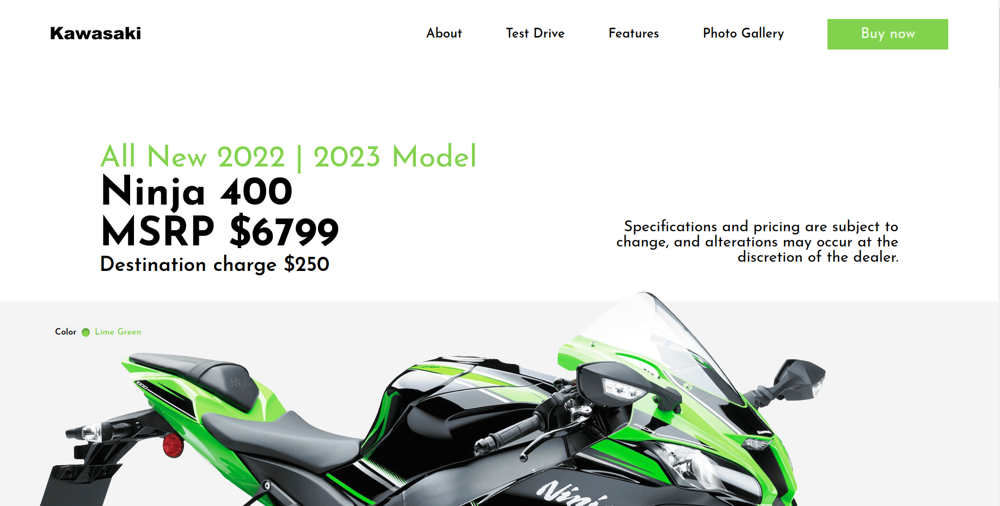
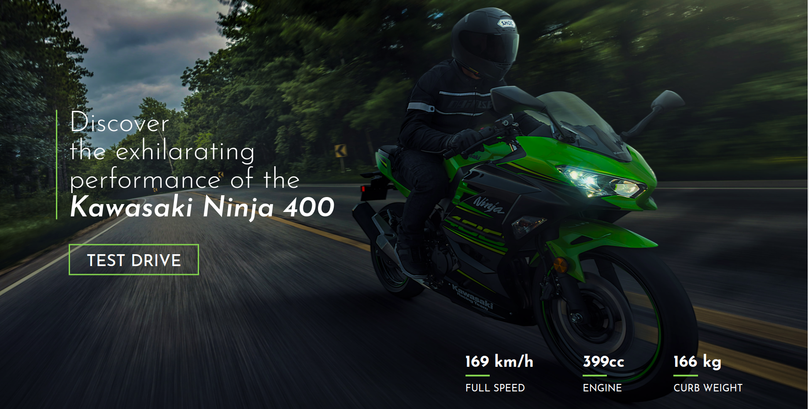
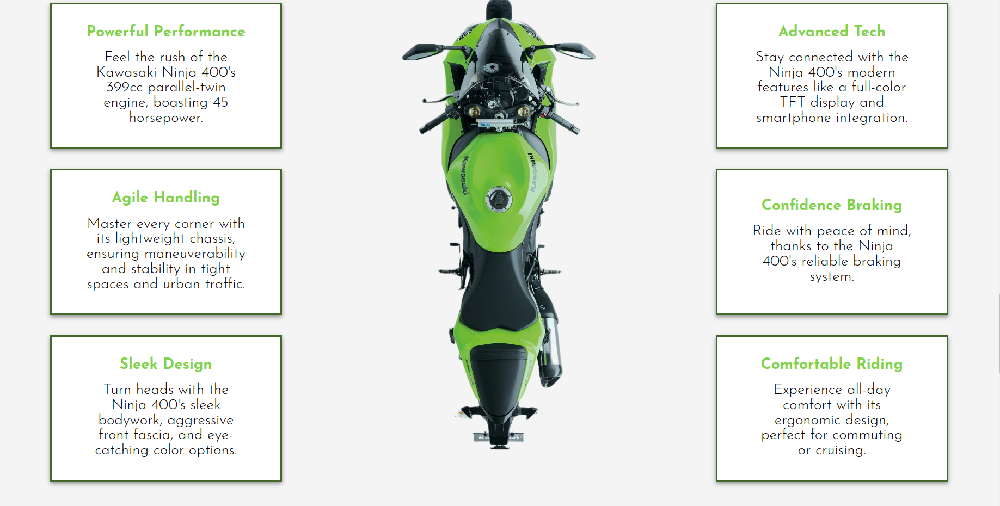
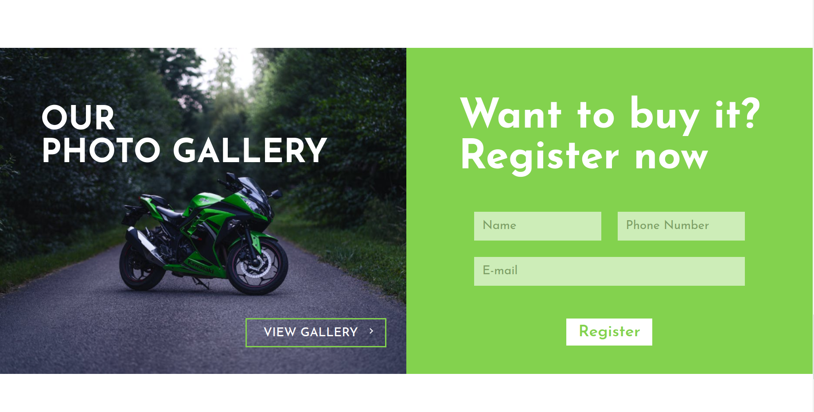
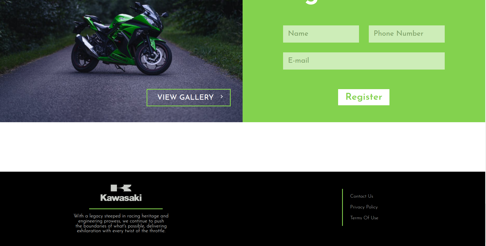

# Landing Page Project 
Web Programming laboratory work no. 2

## Author
Beatricia Golban, FAF-213

## Description
This landing page project is designed to showcase the features and specifications of the Kawasaki Ninja 400, a popular sport motorcycle model. It aims to provide enthusiasts and potential buyers with comprehensive information about the bike, including its performance capabilities, design elements, and technological advancements. Additionally, the landing page seeks to highlight the unique selling points of the Kawasaki Ninja 400, such as its powerful engine, sleek aesthetics, and ergonomic design, with the goal of promoting interest and generating leads among motorcycle enthusiasts and prospective buyers.

## Screenshots
Firstly, we can observe the header and "Hero" section of the web page.

The "Test drive" section can be observed below.

Next, the "Features" section showcases the main advantages of the motorcycle.

The "Photo gallery" and Registration form sections can be observed next to each other.

Last, but not least, the footer at the bottom of the page.

## Live Demo
Click [here](https://buffaloss.github.io/tum-web-lab2/) to explore the live demo using GitHub Pages.

## Features
- **Navigation menu:** The website has a navigation menu with connections to various areas such as About, Test Drive, Features, and Photo Gallery, allowing for simple navigation and user involvement.

- **Hero Section:** The hero section presents crucial information about the Kawasaki Ninja 400, such as the model year, title, MSRP, and destination fee, giving a visually appealing start to the website.  It also shows information on the color of the Kawasaki Ninja 400, such as a graphic representation of the color and its name, which improves the aesthetic appeal and user experience.

- **Test Drive Section:** The test drive part includes a photograph of the Ninja 400 in motion and allows users to experience the bike's exciting performance, hence increasing user engagement and possible leads.

- **Specifications:** The website includes crucial parameters for the Kawasaki Ninja 400, including as maximum speed, engine displacement, and curb weight, giving consumers extensive information about the bike's capabilities.

- **Features Section:** The features section emphasizes several characteristics of the Kawasaki Ninja 400, such as its strong performance, nimble handling, elegant design, sophisticated technology, confident braking, and pleasant riding experience, successfully highlighting the bike's core selling factors and appealing to customers.

- **Photo Gallery Section:** The website contains a photo gallery part where viewers may click a link to another page with photographs of the Kawasaki Ninja 400, which improves the visual appeal and gives consumers a closer look at the bike's design and specifications.

- **Registration Form:** The website has a registration form for users interested in acquiring the Kawasaki Ninja 400. The form offers fields for name, phone number, and email address to facilitate user engagement and lead generation.

- **Footer:** The footer area includes brand information, such as a logo and description. It also offers links to contact information, privacy policies, and terms of service, which increase user confidence and trustworthiness.

- **Color Palette:** The website has a nice design with accent colors of green, black, and white, resulting in a visually attractive and coherent look that complements the corporate identity. The color green highlights crucial features and calls to action, while black and white give contrast and legibility across the site.

## Technologies Used
- HTML
- CSS
